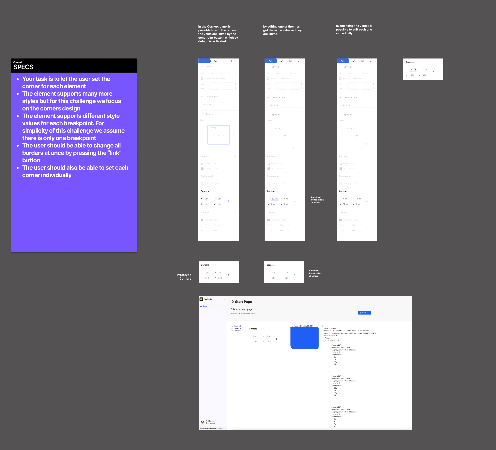

# RsCodingChallenge

- Your task is to let the user set the corner for each element
- The element supports many more styles but for this challenge we focus on the corners design
- The element supports different style values for each breakpoint. For simplicity of this challenge we assume there is only one breakpoint
- The user should be able to change all borders at once by pressing the “link” button
- The user should also be able to set each corner value individually

You can also view the instructions as [PDF]() or you can view it on [Figma](https://www.figma.com/design/JUsAyI2XsJXHL8GGcncAWk/Coding-Challenge)

## Getting Started
- Fork this repository
- npm install
- npm start
- localhost:4200

## Objective
- This repository should give you an impression about our tech stack and coding style
- To give you a first impression of our codebase it resembles the project setup that you would be working on
- This is just a tiny fraction of our actual project (also the rs-uikit is just a partial)
- We would like to see how well you can handle working on an existing project and how you would implement the given challenge
- Also, we would like to see how you deal with already defined design specs

## Tech Stack
- We are using the latest version of Angular. We are currently migrating to Angular Signals
- We use immer to update immutable objects
- We have a monorepo and use NX for that
- We are using Akita for state management, but we want to get rid of it and replace it with Angular Signals
- We have our own design library called Rs-Uikit that is build on top of the Ant Design Library

## Additional resources
- [Angular Signals](https://angular.dev/guide/signals)
- [Immer](https://immerjs.github.io/immer/)
- [Ant Design Library for Angular Apps](https://ng.ant.design/docs/introduce/en)
- [Ant Design Icons](https://ng.ant.design/components/icon/en#ng-content)
- [NX Getting Started](https://nx.dev/getting-started/intro)
- [Akita State Management](https://github.com/salesforce/akita)
